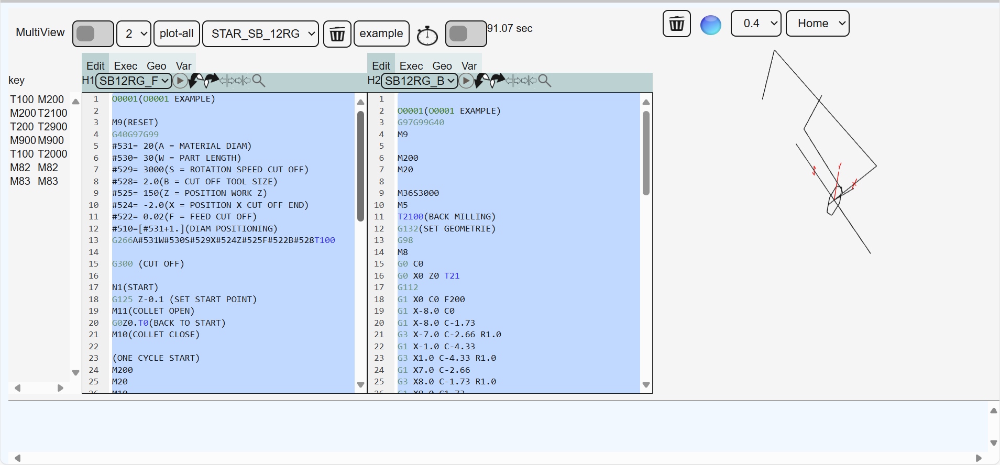

# NC-Edit7
CNC NC code editor view with plot interface. 

The editor integrates the ACE text editor and enables the plotting of toolpaths with the three.js library

It is currently developed as a gui for an nc-code plot 

this script rebuilds the project and then executes `node --test test/parser.service.test.js test/state.service.test.js`, which loads those files from the `test` directory and reports any failures from the services under test. The parser test now covers sync/tool detection, parse completion emission, and empty-program handling, while the state test validates timeline length and cached channel states. `npm test` also runs `test/app-context.test.js`, `test/eventBus.test.js`, and `test/code-pane-renderer.test.js` so the shared services and DOM-free renderer stay verified.
but a beta view is already available

### beta view
you will find a beta view under https://www.star-ncplot.com




## Local build

To rebuild the TypeScript source, install the tooling and run the clean/build scripts:

## Phase 5 demo panels

The `nc-editor-app` demo now renders `<nc-code-pane>` next to three new information panels. `<nc-tool-list>` shows tool numbers and the lines where they appear, `<nc-variable-list>` surfaces NC variables/registers with their most recent line references, and `<nc-executed-list>` keeps the last few timeline entries so you can trace execution progress. All panels consume the same `ChannelState` emitted via `EventBus`, so typing or pasting a program and clicking “Parse channel” updates every panel simultaneously.
```bash
npm install
npm run clean
npm run build
```

The build emits compiled files under `dist` and relies solely on Node 16+ native APIs (no `rimraf`).

## Testing

Phase 2 tests verify the parser and state services using Node's built-in test runner. They rely on the up-to-date `dist` output, so run them via:

```bash
npm run test
```

This script rebuilds the project and then executes `node --test test/parser.service.test.js test/state.service.test.js`, which loads those files from the `test` directory and reports any failures from the services under test. The parser test now covers sync/tool detection, parse completion emission, and empty-program handling, while the state test validates timeline length and cached channel states.

## Phase 3 preview

The new `<nc-editor-app>` web component wires the parser and state services into a simple UI shell with a program editor on the left and a `<nc-channel-panel>` on the right that summarizes parsed state, tools, and errors. To try it manually:

1. Build the project (`npm run build`).
2. Include the compiled bundle (e.g., `<script type="module" src="dist/index.js"></script>`) on a page.
3. Drop `<nc-editor-app></nc-editor-app>` into the HTML body and type or paste an NC program to see the services in action.

## Phase 4 prototype

`<nc-code-pane>` now complements the channel panel by rendering the parsed NC lines, highlighting error rows, and surfacing line/error counts plus the most recent parse timestamp so ACE integration has a visual target. After building, load `dist/index.js` and the component will paint the latest parse whenever `channelUpdated` fires.

## Demo page

You can preview the current shell at `index.html` after running `npm run build`. The page loads `<nc-editor-app>` from `dist/index.js`, so any changes to the app or components will appear once the build completes.
